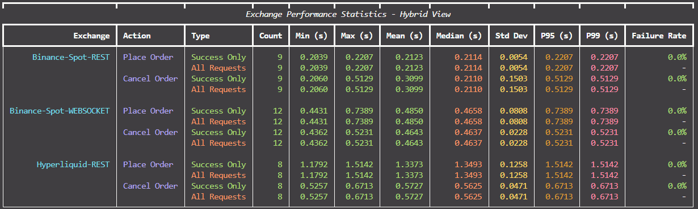

# Exchange Performance Testing Framework

A modular, extensible framework for testing latency across multiple cryptocurrency exchanges.



## 🏗️ **Modular Architecture**

```
src/
├── __init__.py              # Package initialization
├── models.py                # Data models (LatencyData)
├── config.py                # Configuration settings
├── base_exchange.py         # Abstract exchange interface
├── binance_exchange.py      # Binance implementation
├── hyperliquid_exchange.py  # Hyperliquid implementation
├── exchange_factory.py      # Exchange factory pattern
└── performance_tester.py    # Main testing orchestrator

main_modular.py              # Entry point for modular version
```

## 🚀 **Features**

- **Multi-Exchange**: Supports Binance and Hyperliquid simultaneously
- **Robust Cleanup**: Automatic order cancellation and cleanup on exit
- **Safe Order Placement**: Orders placed 5% below market to avoid execution
- **Rich Display**: Live updating statistics table with color coding
- **Comprehensive Logging**: Detailed failure reason tracking and debugging information

## 📊 **Metrics Tracked**

- **Orderbook Latency**: Time to retrieve real-time orderbook data
- **Order Placement**: Time to place limit orders  
- **Order Cancellation**: Time to cancel orders
- **Failure Rates**: Percentage of failed requests for each operation type
- **Advanced Statistics**: Min, Max, Mean, Median, Standard Deviation, P95, P99, Count, and Failure Rate
- **Failure Reasons**: Detailed logging of why requests fail (timeouts, connection errors, API errors, etc.)

## 🔧 **Configuration**

Edit `src/config.py` to customize:

```python
# Test Configuration
DEFAULT_TEST_DURATION = None  # Unlimited time (None = run until stopped)
ORDER_SIZE_BTC = 0.001         # 0.001 BTC orders
MARKET_OFFSET = 0.95           # Place orders 5% below market

# Binance Configuration
BINANCE_CONFIG = {
    'symbol': 'BTCUSDT',
    'account_type': 'portfolio',  # 'spot', 'umfutures', 'portfolio'
    # ... additional configuration
}
# Display Configuration
REFRESH_RATE = 2               # Updates per second
DECIMAL_PLACES = 4             # Precision for latency display
```

### **Binance Account Types**

The framework supports three Binance account types:

- **`spot`**: Binance Spot trading (https://api.binance.com)
- **`umfutures`**: Binance UM (USDT-M) Futures (https://fapi.binance.com)  
- **`portfolio`**: Binance Portfolio Margin (https://papi.binance.com)

Configure via environment variable:
```bash
BINANCE_ACCOUNT_TYPE=spot     # or umfutures, portfolio
```

### **Logging Configuration**

The framework provides comprehensive logging with configurable levels and output options:

```bash
# Logging Configuration
LOG_LEVEL=INFO           # DEBUG, INFO, WARNING, ERROR, CRITICAL  
LOG_TO_FILE=true         # true/false - whether to log to file
LOG_DIR=logs             # directory for log files
```

**Log Levels:**
- **DEBUG**: Detailed information for debugging (request/response details, timing)
- **INFO**: General information about application flow and status
- **WARNING**: Warning messages for non-critical issues
- **ERROR**: Error messages for failures with stack traces
- **CRITICAL**: Critical errors that might cause application shutdown

**Failure Reason Logging:**
- Connection timeouts and network errors
- API authentication failures  
- Invalid response formats
- Rate limiting and throttling
- Order placement/cancellation failures
- WebSocket connection issues

## 📈 **Advanced Statistical Metrics**

The framework provides comprehensive statistical analysis for performance assessment:

### **📏 Central Tendency**
- **Mean**: Average latency across all requests
- **Median**: Middle value when latencies are sorted (P50)

### **📊 Variability Measures**
- **Standard Deviation**: Measures consistency of performance (lower = more consistent)
- **Min/Max**: Best and worst case performance

### **🎯 Percentile Analysis**
- **P95 (95th Percentile)**: 95% of requests complete faster than this time
- **P99 (99th Percentile)**: 99% of requests complete faster than this time

### **🚦 Performance Interpretation**
- **Low Std Dev + Low P99**: Excellent, consistent performance
- **High Std Dev**: Variable performance, investigate network/load issues
- **High P99 vs P95**: Occasional severe outliers, potential timeouts

## 🌟 **Usage**

### Command Line Options
```bash
# Run unlimited time (default)
python main_modular.py

# Run for specific duration
python main_modular.py --duration 60    # 60 seconds

# Show help
python main_modular.py --help
```

### Quick Start
```bash
# Copy environment variables
cp env.example .env

# Edit .env with your API credentials and account type
# BINANCE_API_KEY=your_api_key
# BINANCE_SECRET_KEY=your_secret_key  
# BINANCE_ACCOUNT_TYPE=portfolio  # spot, umfutures, or portfolio
# LOG_LEVEL=INFO                  # DEBUG for detailed logging

# Run the modular version
python main_modular.py
```

### Adding New Exchanges

1. **Create Exchange Class**: Inherit from `BaseExchange`
2. **Implement Required Methods**:
   - `test_orderbook_latency()`
   - `test_order_latency()`
   - `_extract_bids_asks()`
   - `cleanup_open_orders()`
3. **Add to Factory**: Update `ExchangeFactory.create_exchanges()`
4. **Configure**: Add exchange config to `config.py`